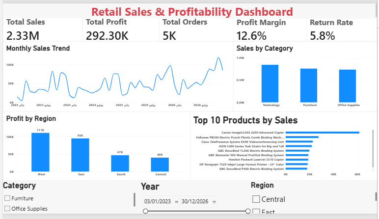

# Retail Sales & Profitability Dashboard

An interactive Power BI dashboard designed to analyze retail sales performance, profitability, orders, returns, and regional performance using the Superstore dataset.

## Project Overview

This project focuses on transforming raw retail order data into an interactive business dashboard using **Power BI**, **Power Query**, and **DAX**.

The dashboard provides a high-level view of sales and profitability while allowing users to explore the data by **Year, Region, and Category**.

## Tools & Technologies

* Power BI Desktop
* Power Query
* DAX
* Data Visualization
* Data Modeling

## Dataset

The project uses the **Superstore sample dataset**, containing retail order information such as:

* Order and shipping dates
* Customers
* Products
* Categories and sub-categories
* Sales
* Quantity
* Discount
* Profit
* Regions

Additional tables were used for regional managers and returned orders.

## Data Preparation

Data preparation was performed using Power Query.

Key preparation steps included:

* Promoting the first row to headers where required.
* Assigning appropriate data types to columns.
* Treating Postal Code as text to preserve its original format.
* Preparing the People and Returns tables for data modeling.
* Checking the structure of the imported tables before loading them into the model.

## Data Model

The dashboard uses three main tables:

* **Orders**
* **People**
* **Returns**

Relationships:

* `People[Region]` → `Orders[Region]`
* `Returns[Order ID]` → `Orders[Order ID]`

The model uses one-to-many relationships with single-direction filtering toward the Orders table.

## DAX Measures

The following measures were created:

```DAX
Total Sales = SUM(Orders[Sales])

Total Profit = SUM(Orders[Profit])

Total Orders = DISTINCTCOUNT(Orders[Order ID])

Total Quantity = SUM(Orders[Quantity])

Profit Margin = DIVIDE([Total Profit], [Total Sales], 0)

Returned Orders = DISTINCTCOUNT(Returns[Order ID])

Return Rate = DIVIDE([Returned Orders], [Total Orders], 0)
```

## Dashboard Features

The dashboard includes:

* Total Sales KPI
* Total Profit KPI
* Total Orders KPI
* Profit Margin KPI
* Return Rate KPI
* Monthly Sales Trend
* Sales by Category
* Profit by Region
* Top 10 Products by Sales
* Year filter
* Region filter
* Category filter

## Key Insights

Based on the dashboard with all filters cleared:

* Total Sales: **$2.33M**
* Total Profit: **$292.30K**
* Total Orders: **5K**
* Profit Margin: **12.6%**
* Return Rate: **5.8%**
* **Technology** is the highest-selling category with approximately **$0.85M** in sales.
* **West** has the highest regional profit at approximately **$111K**.
* **Canon imageCLASS 2200 Advanced Copier** is the top product by sales, with sales exceeding **$60K**.

## Dashboard Preview



## Project Structure

```text
Retail-Sales-PowerBI/
├── README.md
├── Retail-Sales-Dashboard.pbix
└── dashboard.png
```

## Skills Demonstrated

* Power BI Dashboard Development
* Power Query Data Transformation
* DAX Measures
* Data Modeling
* KPI Design
* Data Visualization
* Business Data Analysis
